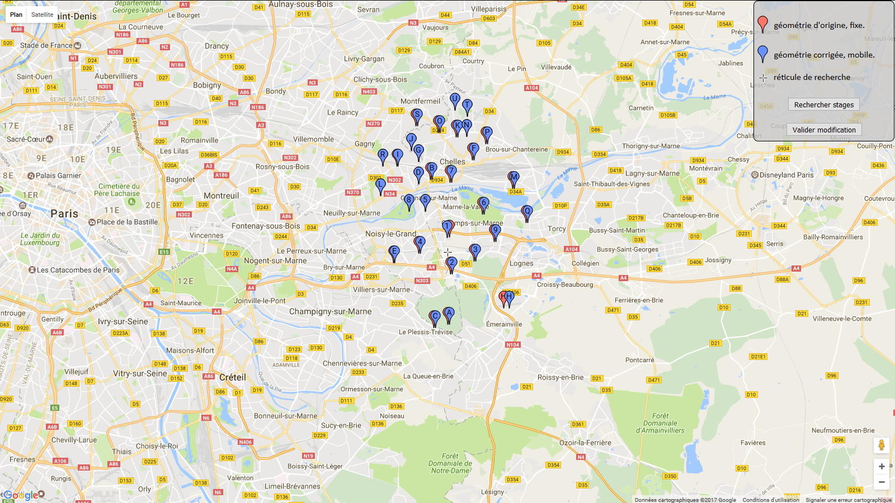

#Micro-projet webmapping, sujet EF13
#Carte des stages - interface de séparation des superpositions

##Prérequis
+ Un serveur PostGreSQL muni de PostGIS, dont l'adresse est à rentrer dans les fichiers PHP dans la fonction pg_connect(), contenant une base de données nommée internships (nom pouvant être changé dans les fichiers PHP, au début, dans la fonction pg_connect())

+ Un serveur web muni de l'extention php_pgsql pour faire fonctionner le PHP

+ Dans la base de données, une table internships (nom pouvant être changé dans le fichier PHP), ayant pour attributs au moins les suivants : id (entier), lat (réel), lng (réel), lat_c (réel, potentiellement NULL) et lng_c (réel, potentiellement NULL)

##Comment utiliser ?
+ Une fois le serveur web lancé, entrer dans un navigateur l'adresse correspondant à l'interface

+ Par défaut, la carte s'initialise autour de l'ENSG (position modifiable dans init.js, dans la fonction initMap()), et charge les 2 stages les plus proches ainsi que jusqu'aux 28 suivants dans un rayon de 28km. Les marqueurs bleu et rouge correspondant au même stage portent le même numéro.

+ On peut modifier la position du centre de la carte et effectuer un nouveau chargement des stages (bouton "Rechercher stages" situé dans le panneau en haut à droite)

+ Les marqueurs rouges sont fixes, ils correspondent à la géométrie d'origine des stages. On peut déplacer les marqueurs bleus pour corriger leur position.

+ Pour valider le déplacement des marqueurs bleus, on clique sur le bouton "Valider modification" situé dans le panneau en haut à droite. Cela a pour effet de transmettre les nouvelles positions au serveur de base de données.

###Capture d'écran de l'interface

##La documentation précise est située dans le dossier doc
